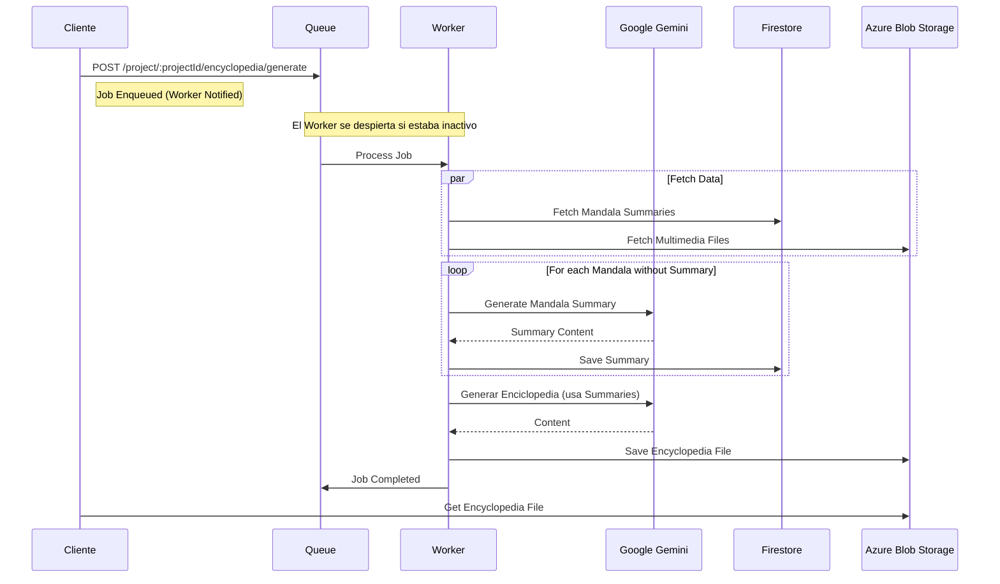
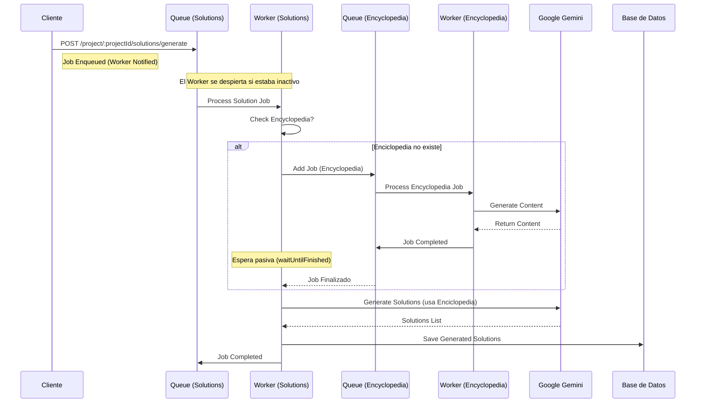

# Arquitectura del Sistema

Este documento detalla las decisiones de diseño, flujos de datos y componentes internos de la plataforma del Austral Worldbuilding Lab.

## 1. Iteración de Mundos

El concepto de **Iteración de Mundos** permite crear versiones alternativas o evoluciones de un proyecto existente, manteniendo el original. Esto es fundamental para explorar "what-if scenarios" en el worldbuilding, y fomentar la iteracion colaborativa. Cada iteracion toma como input la enciclopedia generada por la iteracion anterior (n-1), asi puede mantener el contexto del mundo original y evolucionar en nuevas direcciones

### Estructura Jerárquica
La base de datos modela esto mediante una relación recursiva en la entidad `Project`:

- **`parentProjectId`**: Referencia al mundo del cual se derivó la iteración actual.
- **`rootProjectId`**: Identifica el proyecto original (la raíz del árbol de iteraciones, el punto de partida).
- **`children`**: Permite navegar hacia las iteraciones derivadas de forma rapida, sin tener que recorrer provocaciones.

### Visualización
El frontend utiliza esta estructura para mostrar un árbol o línea de tiempo, permitiendo al usuario navegar entre distintas versiones del mundo.

> El diagrama muestra cómo un proyecto "Raíz" puede ramificarse en múltiples iteraciones.

---

## 2. Sistema de Invitaciones

El sistema maneja dos niveles de acceso mediante invitaciones, permitiendo una granularidad fina en los permisos de colaboración.

### Niveles de Invitación
1. **Organización (`OrganizationInvitation`)**:
   - Otorga acceso a **todos** los proyectos dentro de una organización.
   - Ideal para equipos estables o administradores.
   - Gestionado por la entidad `OrganizationInvitation`.

2. **Proyecto (`Invitation`)**:
   - Otorga acceso a un **único proyecto** específico.
   - Útil para colaboradores externos o invitados temporales.
   - Gestionado por la entidad `Invitation`.

### Invitaciones Recursivas a Proyectos
El sistema de invitaciones gestiona la coherencia narrativa garantizando el acceso a toda la **rama evolutiva** relevante.

**Comportamiento de Propagación**:
Al invitar a un usuario a un proyecto particular, el sistema extiende automáticamente la invitación en dos direcciones, restringiéndose siempre a la misma rama de la historia:
- **Hacia atrás (Ancestros)**: Garantiza acceso a los proyectos padres (`N-1`, `N-2`... `Root`) para que el usuario tenga el contexto histórico completo.
- **Hacia adelante (Descendientes)**: Otorga acceso a las iteraciones futuras derivadas *directamente* de esa línea, permitiendo ver la evolución de esa narrativa específica.

> **Nota**: La propagación no cruza a ramas paralelas (hermanos), manteniendo separadas las líneas de tiempo alternativas.

---

## 3. Arquitectura de Soluciones y Workers

La funcionalidad de generación de soluciones utiliza el contenido de la enciclopedia del proyecto para plantear soluciones, sobre las cuales luego se pueden generar action items e imagenes concretas de esa solución. Dado que este proceso implica mayor complejidad y tiempo de respuesta, se diseñó una arquitectura asíncrona robusta.

### Flujo de Trabajo
1. **Request & Queue**: Cuando el usuario solicita soluciones, el trabajo no se procesa al instante, sino que se encola en **BullMQ**.
2. **Context Awareness**: El sistema verifica la existencia de una enciclopedia actualizada. Si no existe, se genera primero como paso previo.
3. **AI Generation**: Se utiliza Gemini para "razonar" sobre los problemas del proyecto y plantear soluciones concretas.

### Uso Estratégico de Redis
Esta es la **única parte del sistema que utiliza Redis** intensivamente, y la decisión de arquitectura responde a necesidades específicas:
- **Robustez y Pipeline**: Permite soportar una pipeline de trabajos (Soluciones -> Enciclopedia -> IA). Si un paso falla (ej. timeout de la API de IA), el sistema tiene un mecanismo de **fallback y retry automático** (backoff exponencial).
- **Escalabilidad**: Prepara al sistema para soportar múltiples requests de generación simultáneos en el futuro sin bloquear el thread principal de Node.js.
- **Gestión de Latencia**: Como generar soluciones tarda mucho tiempo, desacoplar el proceso en workers evita problemas de timeout en el frontend.

### Diagramas de Flujo

#### Generación de Enciclopedia
Este es el flujo base. La enciclopedia actúa como una capa de síntesis que resume todo el contenido del proyecto para proveer contexto a la IA. Está pensada específicamente para resaltar el **Contexto del Mundo**, **Personajes y Perspectivas**, **Dimensiones y Escalas**, **Patrones y Tendencias**, e **Insights y Oportunidades**. Esto optimiza su posterior uso para la generación de soluciones al eliminar ruido innecesario y enfocar al modelo en lo que realmente importa.

#### Generación de Soluciones (con Dependencia)
La generación de soluciones es más compleja porque **depende** de que exista una enciclopedia. Si no existe, el worker de soluciones puede disparar un job de enciclopedia y esperar a que termine.

### Componentes de Queue
El sistema utiliza dos colas principales gestionadas por servicios específicos que extienden la lógica de "On-Demand":
- `SolutionsQueueService` (`src/modules/queue/services/solutions-queue.service.ts`)
- `EncyclopediaQueueService` (`src/modules/queue/services/encyclopedia-queue.service.ts`)

Ambos servicios registran sus propios procesadores y gestionan el ciclo de vida de los workers para que solo consuman recursos cuando hay trabajos activos.

### Workers On-Demand
Para optimizar el uso de recursos y minimizar costos (especialmente requests a servicios gestionados de Redis como Upstash):
- **On-Demand**: Los workers **no están encendidos 24/7**. Se inician automáticamente solo cuando se detectan trabajos en la cola y se apagan automáticamente cuando quedan inactivos.
- **Configuración Flexible**: Aunque ahora funcionan bajo demanda, el sistema está preparado para cambiar a un modelo "always-on" con un **cambio de configuración menor**.

---

## 4. Arquitectura de Inteligencia Artificial

El módulo de IA está diseñado para ser agnóstico, extensible y eficiente en el manejo de contextos masivos.

### Elección Tecnológica: Google Gemini
La decisión de utilizar **Google Gemini** como motor de IA principal se basa en ventajas críticas para el worldbuilding:

*   **Long Context Window**: El worldbuilding utiliza una diversa cantidad de contenido multimedia. Gemini permite inyectar todos estos archivos en una sola ventana de contexto (hasta 1M+ tokens), eliminando la necesidad de implementar sistemas complejos de RAG (Retrieval-Augmented Generation) manuales.
*   **Files API & Multimedia Nativo**: A diferencia de otros modelos que requieren convertir el contenido multimedia a Base64 (aumentando el tamaño del payload y complejidad), Gemini posee una **Files API** nativa. Esto permite subir archivos multimedia directamente y referenciarlos en el prompt, agilizando drásticamente la iteración y el análisis multimodal.
*   **Velocidad de Iteración**: La combinación de contexto largo y manejo nativo de archivos permite un ciclo de desarrollo mucho más rápido y menos propenso a errores de truncado de datos.

### Patrones de Diseño
Para garantizar la mantenibilidad y escalabilidad del código de IA, se implementaron los siguientes patrones:

1.  **Adapter Pattern**:
    *   **Propósito**: Desacoplar la lógica de negocio del proveedor de IA específico.
    *   **Implementación**: `AiAdapterUtilsService` y `GeminiAdapter`.
    *   **Beneficio**: Permite cambiar el modelo (ej. de Gemini a GPT-4 o Claude) sin modificar el resto del sistema, creando un nuevo adapter.

2.  **Strategy Pattern**:
    *   **Propósito**: Encapsular la lógica de generación específica para cada tipo de contenido.
    *   **Implementación**: Directorio `src/modules/ai/strategies/`. Cada tipo de generación (Soluciones, Enciclopedia, Preguntas, Imágenes) tiene su propia estrategia aislada.
    *   **Beneficio**: Facilita agregar nuevas capacidades de generación (ej. "Generar Guión de Video") sin tocar el código existente, solo registrando una nueva estrategia.

3.  **Composite Pattern (Prompt Builder)**:
    *   **Propósito**: Construir prompts complejos de manera modular y reutilizable.
    *   **Implementación**: `AiPromptBuilderService`.
    *   **Beneficio**: Mas facil de entender que input recibe cada generacion. Los prompts se componen dinámicamente combinando:
        *   **Instrucciones del Ciclo** (ej. "Ciclo 1").
        *   **Variables de Contexto** (Timeline de provocaciones, descripcion del proyecto, dimensiones, escalas, mandalas).
        *   **Tarea Específica** (Prompt base).

### Gestión de Archivos Multimedia

El sistema integra un módulo de **Caché de Archivos** (`GeminiFileCacheService`) diseñado para gestionar eficientemente el ciclo de vida de los recursos multimedia en la API de Google Gemini.

Dado que la API de Gemini mantiene los archivos disponibles por un tiempo limitado (48 horas), este servicio actúa como una capa de persistencia intermedia que:

1.  **Consulta el Estado**: Verifica si el archivo ya existe y es válido en la tabla `GeminiFileCache`.
2.  **Gestiona la Carga**:
    *   Si el archivo ya está en la nube de Google y vigente, reutiliza el `fileUri` sin volver a subirlo.
    *   Si no existe o expiró, realiza el upload y registra los nuevos metadatos.
3.  **Mantenimiento**: Purga automáticamente las referencias a archivos que han superado el TTL de 48 horas.

Esta arquitectura optimiza el ancho de banda y reduce la latencia en flujos de trabajo iterativos donde se reutiliza el mismo contexto multimedia repetidamente.

## Arquitectura de Despliegue Multi-Cloud

El diagrama de despliegue ilustra una arquitectura híbrida y distribuida que integra servicios de **Microsoft Azure**, **Google Cloud Platform** y proveedores **Serverless** especializados. Esta configuración responde a tres pilares de diseño: eficiencia de costos, escalabilidad bajo demanda y desacoplamiento de servicios.

Nos decidimos por usar servicios gestionados de Azure (App Service, Database for PostgreSQL, Blob Storage) en lugar de levantar todo en una máquina virtual tradicional. La razón principal es que con PaaS no tenemos que preocuparnos por mantener el sistema operativo, aplicar medidas de seguridad, ni configurar backups manualmente: Azure se encarga de todo eso. Además, escalar es mucho más simple (básicamente mover un slider) y solo pagamos por lo que usamos, lo cual es ideal para un proyecto donde el tráfico es variable y el presupuesto limitado.

A continuación, se detallan las decisiones estratégicas representadas en el esquema:

#### A. Estrategia Diferenciada de Entornos (Dev vs. Prod)
Para equilibrar la estabilidad operativa con la optimización del presupuesto, implementamos una infraestructura asimétrica en la capa de datos relacional:

* **Entorno de Producción (Prod):** El backend se conecta a una instancia dedicada de **Azure Database for PostgreSQL**. Esto posibilita las copias de seguridad automáticas y la retención de datos dentro del ecosistema de seguridad de Azure.
* **Entorno de Desarrollo (Dev):** Se utiliza **NeonDB**, una base de datos PostgreSQL *Serverless* con costo cero. Esta decisión permite que la base de datos "escale a cero" cuando el equipo de desarrollo no está activo, reduciendo drásticamente los costos de infraestructura ociosa sin sacrificar la compatibilidad del código, ya que ambos entornos utilizan el mismo motor SQL.

#### B. Gestión de Colas y Eficiencia de Costos (La Decisión de Upstash)
Para el manejo de colas asíncronas con **BullMQ**, el sistema requiere una instancia de Redis. En esta fase del proyecto, se tomó la decisión arquitectónica de utilizar **Upstash (Serverless Redis)** de manera transversal para ambos entornos (Dev y Prod), en lugar de aprovisionar una instancia nativa de *Azure Redis Cache*.

**Justificación Técnica y Económica:**
* **Modelo de Costos:** Azure Redis Cache implica un costo fijo mensual por reserva de instancia, independientemente del uso. Dado el patrón de tráfico actual del sistema (cargas de trabajo por lotes o "bursts"), este costo no se justifica. Upstash ofrece un modelo de pago por petición (*pay-per-request*), resultando en una operación prácticamente gratuita durante los tiempos de inactividad.
* **Compatibilidad:** Al utilizar el protocolo estándar de Redis, esta decisión no genera *vendor lock-in*. Si el volumen de tráfico escala en el futuro, la migración a una instancia dedicada de Azure Redis solo requeriría un cambio en las variables de entorno (`REDIS_HOST`).

#### C. Orquestación Reactiva de Medios
El diagrama destaca el flujo *Event-Driven* para el procesamiento de archivos:
1.  El cliente sube archivos directamente a **Azure Blob Storage** mediante *Presigned URLs*, evitando la saturación del ancho de banda del Backend.
2.  **Azure Event Grid** detecta la finalización de la carga y dispara un Webhook hacia el **App Service**.
3.  Esto inicia el ciclo de procesamiento (extracción de audio con FFmpeg y análisis con Gemini) de forma asíncrona, liberando al usuario de esperar con el navegador abierto.